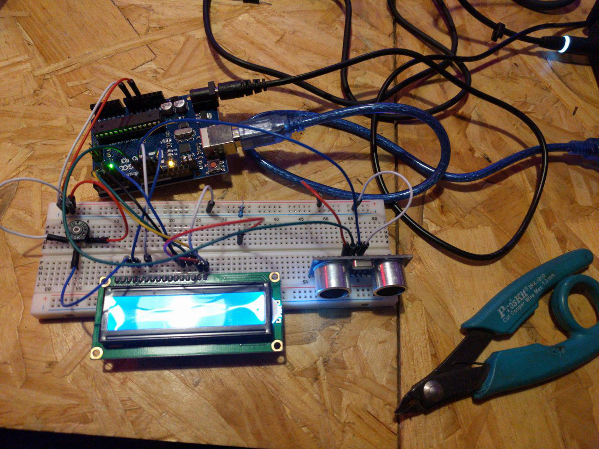

# 2018-01-17

* Nos reunimos y empezamos a probar sensores con arduino. Probamos un sensor de proximidad e intentamos mostrar el valor en un display LCD.
* El sensor de proximidad anda genial, pero no pudimos mostrar el valor en el LCD porque la prueba de concepto documentada en el sitio de arduino no nos funcionó. Continuaremos la próxima vez.

# 2018-01-05

* Vamos a empezar con las pruebas de concepto en el rio Reconquista, en el partido de San Martín, porque tenemos contactos y ya hay datos para contrastar
* Hablamos con Jorge, un contacto de la organización que agrupa organizaciones del rio Reconquista, propuso una reunión la semana que viene para charlar e ir a ver la zona
* No podemos ir en la semana, vamos a volver a hablar post-vacaciones, a comienzos de febrero

## 2018-01-03

* Creamos repro y proyecto en github
* Definimos el primer [backlog](https://github.com/rlyehlab/ciencia-comunitaria/projects/1#column-1958569)
* Resolvimos que necesitamos ir al campo para terminar de definir el backlog con la información que sacamos de hablar con la gente
* seykron va a contactar a Dani para hacer el contacto y tratar de ir a campo en enero
